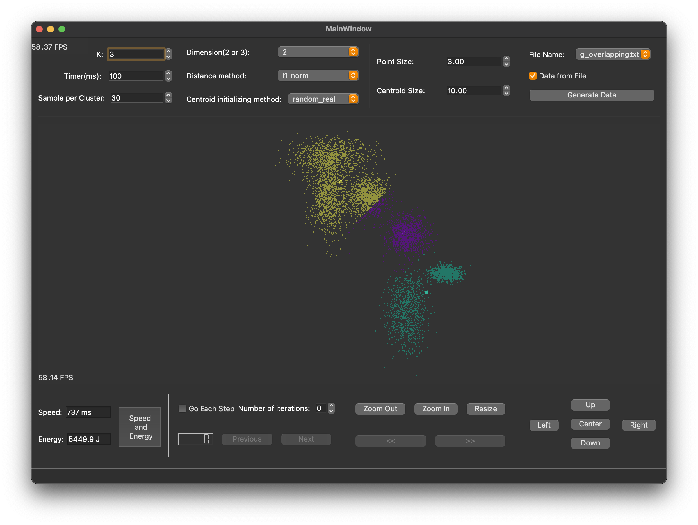

# VisionComputing-KMeans

This is the repository for K-Means algorithm in Vision Computing course assignment 4

**Author:** Haoxiang Zhang

**IDE:** 

Qt Creator

# Assignment Requirements
 [Updated Version Assignment Requirements](Documents/assignment_requirements.md)

 [Slides for K-Means clustering Assignment4](Documents/Slides_K-Means-clustering_Assignment4.pdf)

 Notion: [Assignment Requirements (Old version)](https://www.notion.so/VC-Assignment-K-Means-Algorithm-e444e3c22eb04eb795fbd09a0948ab56)

# Assignment Report
 [Report](Documents/vc_final_project_report_haoxiang_zhang.pdf)

# UI Explain

For the layout of GUI on the left top section:
  - the number of cluster K (range: [2, 99999])
  - timer (duration between iterations, range: [100, 10000] ms)
  - sample per cluster (Only for when randomly generating data, range: [10, 1000])

Second section on top, the dimension can be chosen by 2 or 3. The distance method and the Centroid initializing method have fixed choices.

 

For the rest of the part on top, the point size and center size could be changed by the user. If the user wants to generate data from files, first check "Data From File" and then choose the txt file name. Once the "Data from File" checkbox is enabled, the data will not be randomly generated. The choices of text files could be:

The center part is the ViewWidget which displays the process of the project. For the first block at the bottom, once the K-Means is done, the user can click the "Speed and Energy button" to display the value. If the user wants to step through each iteration, the "Go Each Step" checkbox should be enabled, and choose the number of iterations. The digital display box shows the current iteration. The [Previous] and [Next] buttons will be disabled when step to end-iterations.
    
The right-half side of the bottom operation area controls the view. Users can zoom in, zoom out, or go back to the original position. The buttons [ << ] and [ >> ] allow user to rotate the view by \{0.5, 1.0, 0.5\}. The Up, Down, Left, Right, and Center buttons control the position of **The eye**.

# Examples
## Generate data from file d-ring.txt

## Generate data from file g.txt (Overlapping)

